# WooCommerce JohnQuery UCP - Universal Commerce Protocol

[](https://wordpress.org/)
[](https://woocommerce.com/)
[](https://php.net/)
[](https://www.gnu.org/licenses/gpl-2.0.html)
[](https://github.com/johnquery/woocommerce-johnquery-ucp)

Enable AI agents like Google Gemini, ChatGPT, and Claude to purchase products from your WooCommerce store using the **Universal Commerce Protocol (UCP)**.

## 🤖 What is UCP?

The [Universal Commerce Protocol (UCP)](https://developers.google.com/commerce/ucp) is an open standard by Google that allows AI agents to interact with e-commerce stores programmatically. This plugin implements UCP for WooCommerce, making your store AI-commerce ready.

### How It Works

```mermaid
graph TB
    subgraph "Participants"
        A[🤖 AI Agent<br/>Gemini/ChatGPT/Claude]
        B[⚡ UCP Plugin<br/>WP Plugin]
        C[🏪 WooCommerce<br/>WC Store]
        D[👤 User<br/>Customer]
    end

    A --> B --> C --> D

    subgraph "UCP Checkout Flow"
        S1[1️⃣ Create Session<br/>AI creates cart with products<br/>POST /checkout-sessions]
        S2[2️⃣ Add Address<br/>User provides shipping info<br/>PUT /checkout-sessions/id]
        S3[3️⃣ Select Shipping<br/>User selects shipping method<br/>PUT /checkout-sessions/id]
        S4[4️⃣ Complete<br/>Returns confirm url<br/>POST /checkout-sessions/id/complete]
        S5[5️⃣ User Completes Payment<br/>User opens confirm_url in browser<br/>→ WooCommerce checkout with pre-filled cart<br/>→ Selects payment method<br/>→ Places order!]

        S1 --> S2
        S2 --> S3
        S3 --> S4
        S4 --> S5
        S5 -.-> S1
    end

    subgraph "Session Status"
        ST1[🟡 incomplete]
        ST2[🟢 ready_for_complete]
        ST3[🔵 requires_escalation]
        ST4[🟢 complete]
    end

    style S1 fill:#4a5568,stroke:#cbd5e0,color:#fff
    style S2 fill:#805ad5,stroke:#d6bcfa,color:#fff
    style S3 fill:#0987a0,stroke:#76e4f7,color:#fff
    style S4 fill:#2f855a,stroke:#9ae6b4,color:#fff
    style S5 fill:#9f2042,stroke:#feb2b2,color:#fff
```



## ✨ Features

- **Discovery Endpoint** - Exposes your store's UCP profile at `/.well-known/ucp`
- **Checkout Sessions** - AI agents can create and manage checkout sessions via REST API
- **Shipping Calculation** - Automatic shipping options based on customer address
- **Embedded Checkout** - Secure payment handling through WooCommerce's native checkout
- **Cart Pre-fill** - Customer info and cart automatically loaded when user opens checkout
- **Order Tracking** - Link UCP sessions to WooCommerce orders
- **Agent Whitelist** - Optional security to restrict which AI agents can access your store
- **Debug Mode** - Detailed logging for troubleshooting

## 📋 Requirements

- WordPress 6.0 or higher
- WooCommerce 8.0 or higher
- PHP 8.0 or higher
- SSL certificate (HTTPS required)

## 🚀 Installation

### From ZIP File

1. Download the latest release ZIP file
2. Go to **WordPress Admin → Plugins → Add New → Upload Plugin**
3. Upload the ZIP file and click **Install Now**
4. Activate the plugin
5. Go to **WooCommerce → UCP (AI Commerce)** to configure settings
6. Click **"Create Endpoint File"** to create the discovery endpoint

### Manual Installation

1. Upload the `woocommerce-johnquery-ucp` folder to `/wp-content/plugins/`
2. Activate the plugin in WordPress admin
3. Configure settings in **WooCommerce → UCP (AI Commerce)**
4. Create the discovery endpoint file

## ⚙️ Configuration

After activation, go to **WooCommerce → UCP (AI Commerce)**:

| Setting             | Description                             | Default    |
| ------------------- | --------------------------------------- | ---------- |
| **Enable UCP**      | Turn on/off AI commerce functionality   | Enabled    |
| **Session Timeout** | How long checkout sessions remain valid | 30 minutes |
| **Agent Whitelist** | Restrict access to specific AI agents   | Disabled   |
| **Debug Mode**      | Enable logging for troubleshooting      | Disabled   |

### Discovery Endpoint Status

The settings page shows whether the `.well-known/ucp` endpoint is active. Click **"Create Endpoint File"** if it shows "File missing".

## 🔌 API Endpoints

All endpoints use the namespace: `/wp-json/wc-jq-ucp/v1/`

| Endpoint                           | Method | Description                                   |
| ---------------------------------- | ------ | --------------------------------------------- |
| `/.well-known/ucp`                 | GET    | Discovery profile (standard location)         |
| `/profile`                         | GET    | Discovery profile (REST API)                  |
| `/checkout-sessions`               | POST   | Create checkout session                       |
| `/checkout-sessions/{id}`          | GET    | Get session details                           |
| `/checkout-sessions/{id}`          | PUT    | Update session (add address, select shipping) |
| `/checkout-sessions/{id}/complete` | POST   | Complete checkout                             |
| `/checkout-sessions/{id}/cancel`   | POST   | Cancel session                                |
| `/orders/{id}`                     | GET    | Get order details                             |

### Required Header

All checkout endpoints require the `UCP-Agent` header:

```
UCP-Agent: profile="https://api.openai.com/.well-known/ucp"
```

## 🛒 Complete Checkout Flow

### Step 1: Create Checkout Session

```bash
curl -X POST https://yourstore.com/wp-json/wc-jq-ucp/v1/checkout-sessions \
  -H "Content-Type: application/json" \
  -H 'UCP-Agent: profile="https://api.openai.com/.well-known/ucp"' \
  -d '{
    "line_items": [
      {"item": {"id": "72"}, "quantity": 1}
    ],
    "currency": "PHP"
  }'
```

**Response:** Returns session with `status: "incomplete"`

### Step 2: Add Shipping Address

```bash
curl -X PUT https://yourstore.com/wp-json/wc-jq-ucp/v1/checkout-sessions/{session_id} \
  -H "Content-Type: application/json" \
  -H 'UCP-Agent: profile="https://api.openai.com/.well-known/ucp"' \
  -d '{
    "buyer": {
      "email": "customer@example.com",
      "first_name": "Juan",
      "last_name": "Dela Cruz",
      "phone": "+639171234567"
    },
    "fulfillment": {
      "methods": [{
        "type": "shipping",
        "destinations": [{
          "full_name": "Juan Dela Cruz",
          "street_address": "123 Rizal Street",
          "address_locality": "Makati City",
          "address_region": "Metro Manila",
          "postal_code": "1200",
          "address_country": "PH"
        }]
      }]
    }
  }'
```

**Response:** Returns available shipping options in `fulfillment.methods[].groups[].options`

### Step 3: Select Shipping Method

```bash
curl -X PUT https://yourstore.com/wp-json/wc-jq-ucp/v1/checkout-sessions/{session_id} \
  -H "Content-Type: application/json" \
  -H 'UCP-Agent: profile="https://api.openai.com/.well-known/ucp"' \
  -d '{
    "fulfillment": {
      "methods": [{
        "type": "shipping",
        "groups": [{
          "id": "shipping_group_1",
          "selected_option_id": "free_shipping:1"
        }]
      }]
    }
  }'
```

**Response:** Returns session with `status: "ready_for_complete"`

### Step 4: Complete Checkout

```bash
curl -X POST https://yourstore.com/wp-json/wc-jq-ucp/v1/checkout-sessions/{session_id}/complete \
  -H "Content-Type: application/json" \
  -H 'UCP-Agent: profile="https://api.openai.com/.well-known/ucp"' \
  -d '{
    "payment_data": {
      "handler_id": "wc_embedded_checkout"
    }
  }'
```

**Response:** Returns `continue_url` for user to complete payment

```json
{
  "status": "requires_escalation",
  "continue_url": "https://yourstore.com/checkout/?ucp_session=chk_xxx"
}
```

### Step 5: User Completes Payment

The user opens the `continue_url` in their browser. The checkout page loads with:

- ✅ Cart pre-filled with products
- ✅ Customer info pre-filled
- ✅ Shipping address pre-filled
- ✅ Shipping method selected

User selects payment method (e.g., Bank Transfer, COD) and clicks **"Place Order"**.

## 🔒 Security

- All API endpoints require the `UCP-Agent` header for identification
- Optional agent whitelist to restrict access to trusted AI platforms
- Checkout sessions automatically expire after configurable timeout
- Payment handling is done through WooCommerce's secure checkout
- No sensitive payment data is handled by this plugin
- Sessions are stored in a dedicated database table with encryption support

## 🧪 Testing with Postman

A Postman collection is included for testing. Import `WooCommerce-JohnQuery-UCP.postman_collection.json`.

### Collection Variables

| Variable     | Description                       | Example                 |
| ------------ | --------------------------------- | ----------------------- |
| `base_url`   | Your store URL                    | `https://yourstore.com` |
| `product_id` | A product ID to test              | `72`                    |
| `currency`   | Your store currency               | `PHP`                   |
| `session_id` | Auto-saved after creating session |                         |

### Test Flow

Run requests in this order:

1. **Create Checkout Session** → Creates cart
2. **Update (Add Shipping Address)** → Gets shipping options
3. **Update (Select Shipping Method)** → Ready for payment
4. **Complete Checkout** → Returns payment URL
5. Open `continue_url` in browser → Complete payment

## 📁 Plugin Structure

```
woocommerce-johnquery-ucp/
├── woocommerce-johnquery-ucp.php    # Main plugin file
├── uninstall.php                     # Cleanup on deletion
├── README.md                         # This file
├── assets/
│   └── css/
│       └── admin.css                 # Admin styles
└── includes/
    ├── class-wc-jq-ucp-session.php   # Session management
    ├── class-wc-jq-ucp-checkout.php  # Checkout logic
    ├── class-wc-jq-ucp-install.php   # Installation/activation
    ├── class-wc-jq-ucp-settings.php  # Settings management
    ├── class-wc-jq-ucp-crypto.php    # Cryptographic functions
    ├── api/
    │   ├── class-wc-jq-ucp-rest-discovery.php   # Discovery endpoint
    │   ├── class-wc-jq-ucp-rest-checkout.php    # Checkout endpoints
    │   └── class-wc-jq-ucp-rest-order.php       # Order endpoints
    ├── admin/
    │   └── class-wc-jq-ucp-admin.php            # Admin interface
    └── helpers/
        ├── class-wc-jq-ucp-formatter.php        # Data formatting
        └── class-wc-jq-ucp-validator.php        # Input validation
```

## 🗄️ Database

The plugin creates one custom table:

**Table:** `{prefix}_wc_jq_ucp_sessions`

| Column        | Type        | Description                         |
| ------------- | ----------- | ----------------------------------- |
| `id`          | BIGINT      | Primary key                         |
| `session_id`  | VARCHAR(64) | Unique session identifier (chk_xxx) |
| `status`      | VARCHAR(32) | Session status                      |
| `currency`    | VARCHAR(3)  | Currency code                       |
| `buyer_data`  | LONGTEXT    | Customer information (JSON)         |
| `line_items`  | LONGTEXT    | Cart items (JSON)                   |
| `totals`      | LONGTEXT    | Price totals (JSON)                 |
| `fulfillment` | LONGTEXT    | Shipping info (JSON)                |
| `payment`     | LONGTEXT    | Payment handlers (JSON)             |
| `wc_order_id` | BIGINT      | Linked WooCommerce order ID         |
| `created_at`  | DATETIME    | Creation timestamp                  |
| `updated_at`  | DATETIME    | Last update timestamp               |
| `expires_at`  | DATETIME    | Expiration timestamp                |

## 🧹 Uninstallation

When you **delete** the plugin (not just deactivate):

- ✅ Database table is dropped
- ✅ All plugin options are removed
- ✅ `.well-known/ucp/` directory is removed
- ✅ Scheduled tasks are cleared
- ❌ Order meta is preserved (for order history)

The `.well-known/` parent folder is NOT deleted as it may be used by other services (SSL, Apple Pay, etc.).

## 📝 Changelog

### Version 1.5.0

- Added vendor prefix (`wc_jq_ucp_`) for conflict prevention
- Updated branding to JohnQuery
- Improved session management
- Enhanced shipping calculation
- Better error handling

### Version 1.4.0

- Added cart pre-fill on checkout page
- Link orders to UCP sessions
- Improved admin interface

### Version 1.3.0

- Fixed shipping calculation in REST API context
- Initialize WooCommerce session properly

### Version 1.2.0

- Added uninstall.php for clean removal
- Added discovery endpoint status indicator

### Version 1.1.0

- Initial release with core UCP functionality

## 🤝 Contributing

Contributions are welcome! Please feel free to submit a Pull Request.

## 📄 License

This plugin is licensed under the [GPL v2 or later](https://www.gnu.org/licenses/gpl-2.0.html).

## 👤 Author

**JohnQuery**

- Website: [https://www.johnquery.com](https://www.johnquery.com)

## 🙏 Acknowledgments

- [Google UCP Specification](https://developers.google.com/commerce/ucp)
- [WooCommerce](https://woocommerce.com/)
- [WordPress](https://wordpress.org/)

---

Made with ❤️ by [JohnQuery](https://www.johnquery.com)
